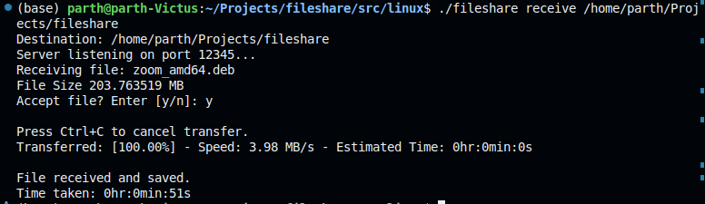
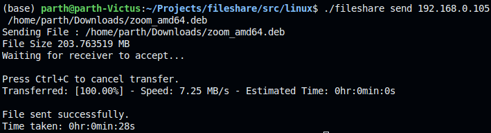

# fileshare
A command-line tool written in C++ to transer files on a local network without internet access or third-party server.

## Features
- File Transfer : Breaks large files into chunks and transmits them reliably to a peer.
- Cancellation Support : Ctrl+C signal handling stops transfers gracefully and deletes partial files.
- Cross-Platform : Uses standalone Asio for networking, compatible with Windows (MinGW/MSVC) and Linux.
- Command-line Interface : Lightweight and scriptable for power users and automation setups.

## Usage

- Open a terminal navigate to directory which has executable.
- Run the executable program with appropriate arguments:\
<code> ./fileshare send <receiver_ip> <file_path> </code>\
<code> ./fileshare receive <save_directory> </code>

Note : Receiver should run the program first.

## Installation
You can either build the executable program from source code or get it from releases.

### Download Executable

- Linux
- Windows

On linux run <code>chmod +x ~/path/fileshare</code> to give it execution permission. 

### Building

1. Download and extract source files.
2. Navigate to linux or windows directory.
3. Compile the program using below commands.

Linux:\
<code>
g++ -std=c++17 -Iasioinclude -o fileshare fileshare.cpp -lpthread
</code>

Windows:\
<code>
g++ -D_WIN32_WINNT=0x0601 -Iasioinclude fileshare.cpp -o fileshare -lws2_32 -lpthread
</code>

